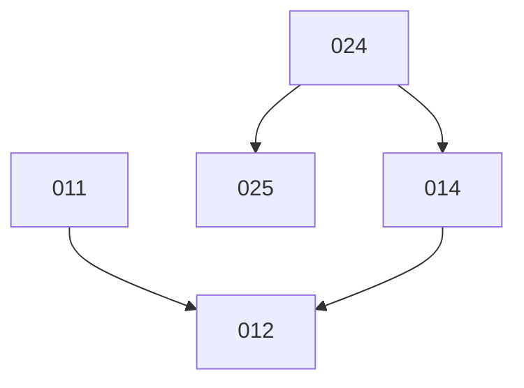

# Slice run DAG

_Updated 2026-09-20 · 1 lane · 5 pending slices. Re-run /dev:slice-dag after slices land or change._

Pending slices live under `slices/backlog/NNN_slug/` in this repo — that folder is the disk truth
Phase 1 enumerates, not `slices/NNN_*/`.

## Lane plan

| Lane 1     |
| ---------- |
| [ ] 024    |
| [ ] 011    |
| [ ] ⛔ 014 |
| [ ] 012    |
| [ ] ⛔ 025 |

- Finish a **row** before starting the next — each row is a barrier wave, so every slice runs
  only once everything above it is checked off (that is what guarantees the ordering).
- Each **column** is one of your parallel sessions; a `-` is a lane left idle that wave. At one
  lane this is simply the run order.
- `⛔ 014` means the slice has an unresolved **gate** (see *Hotspots & gates*) — clear it first.

## Inventory

The cached analysis — re-runs reuse these rows and only analyse slices not already listed. No
names in the lane plan, but here scope is fine.

| Slice | Subprojects                                                  | Needs   | Gate                              | Scope                                                              |
| ----- | ------------------------------------------------------------ | ------- | --------------------------------- | ------------------------------------------------------------------ |
| 011   | JenkinsPipelineUtils, KubeCoder, KubeCoderDeploy, HelmCharts  | —       | —                                 | KubeCoder CI: version-pin commits instead of deploys (B.3)          |
| 012   | Ansible (docs/runbooks), KubeCoderDeploy, KubeCoder           | 011,014 | —                                 | KubeCoder cutover: TF state surgery + per-stage runbook (B.4+B.5)   |
| 014   | ArgoCDDeploy, KubeCoderDeploy, JenkinsPipelineUtils, HelmCharts | 024   | KC-68 `aac-tools` toolchain       | Architecture producers for the deploy repos                         |
| 024   | ArgoCDTools                                                   | —       | —                                 | `aac-tools` image: generator + `arch-validate`, folder per image    |
| 025   | ArgoCDTools, HelmCharts                                       | 024     | second migration chosen           | Architecture: cross-app edges resolve through the published set     |

## Graph

Only **hard ordering** (`needs`) edges are drawn. Merge relationships are not edges — they are
derived from the shared subprojects in the inventory.

## Hotspots & gates

- **Subproject touch counts** (merge pressure): KubeCoderDeploy ×3, HelmCharts ×3,
  JenkinsPipelineUtils ×2, ArgoCDTools ×2, KubeCoder ×2, ArgoCDDeploy ×1, Ansible ×1.
- **Codegen/drift-gated component** — the architecture generator (`aac-tools` in ArgoCDTools, and
  HelmCharts' own `gen_architecture.py`, which stays and is only patched). 024, 014 and 025 all
  move around it; never run two of them in the same wave at a higher lane count.
- **Gates:**
  - `014` — the `aac-tools` toolchain must enter the KubeCoder catalog (**KC-68**, KubeCoder's own
    work) and the environments must pick it up. The pod has no docker, so a deploy repo's local
    gate reaches the tools only through `cexec aac-tools …`. That step sits *between* 024 and 014
    and no run loop can take it — which is why 024 is a separate slice.
  - `025` — waits until the second app migration is chosen; may be folded into that migration's
    slice if it turns out small. Not needed for KubeCoder (no cross-app edge, checked 2026-09-20).
- **Lane rationale:**
  - **024 first** even though 011 is also unblocked: it has the most dependents (014, 025, plus
    ANS-78) and its gate KC-68 can only start once the image exists, so shipping it first buys the
    toolchain step the most wall-clock.
  - **011 second** — unblocked (its need, slice 010, is completed), and 012 cannot start without it.
  - **014 before 012**: 014's hard ordering is *before slice 012's prd flip*. The **dev** flip does
    not wait on 014, so if KC-68 stalls, 012's dev half may be pulled forward ahead of 014 — but
    then 012 must be split at the stage boundary, which is why the default plan keeps it whole and
    behind 014.
  - **025 last** — gated and off the critical path; nothing else waits on it.
  - **Not a gate, but a constraint on 011:** its `Build-Main` Jenkinsfile edit lives in
    `/work/KubeCoder`, whose gate needs `python`/`frontend` tool containers this environment lacks.
    Never target `../KubeCoder` with a run-loop phase from here — that part lands in KubeCoder's own
    environment. The same applies to 012's controller pull-policy removal.
  - **012 is operator keystrokes almost end to end** (every `terraform state rm`/`mv`, `plan`, helm
    invocation and Argo sync). The slice's deliverable is the runbook plus the authored artefacts;
    budget the session for preparing commands and parsing returned output, not for converging.
