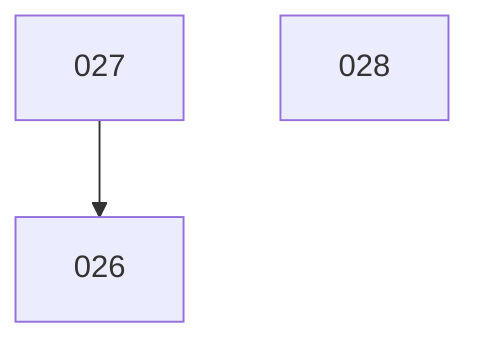

# Slice run DAG

_Updated 2026-09-25 · 3 lanes · 3 pending slices. Re-run /dev:slice-dag after slices land or change._

Pending slices are the planned ones under `slices/NNN_slug/`; `/dev:plan-slice` promotes a slice there
out of `slices/backlog/`. Backlog slices (029, 030 today) are triaged but unplanned, so they stay out
of the plan until they are promoted.

## Lane plan

| Lane 1     | Lane 2 | Lane 3 |
| ---------- | ------ | ------ |
| [ ] ⛔ 027 | -      | -      |
| [ ] ⛔ 028 | -      | -      |
| [ ] 026    | -      | -      |

- Finish a **row** before starting the next — each row is a barrier wave, so every slice runs
  only once everything above it is checked off (that is what guarantees the ordering).
- Each **column** is one of your parallel sessions; a `-` is a lane left idle that wave.
- `⛔ 027` means the slice has an unresolved **gate** (see *Hotspots & gates*) — clear it first.

## Inventory

The cached analysis — re-runs reuse these rows and only analyse slices not already listed. No
names in the lane plan, but here scope is fine.

| Slice | Subprojects                                                                                                                                                     | Needs | Gate                  | Scope                                                                                              |
| ----- | --------------------------------------------------------------------------------------------------------------------------------------------------------------- | ----- | --------------------- | -------------------------------------------------------------------------------------------------- |
| 026   | ArgoCDTools (aac-tools), Ansible (architecture), Architecture, KubeCoderDeploy, ArgoCDDeploy, PrometheusDeploy, every deploy repo (48), every `arch-validate.py` carrier (~31) | 027   | —                     | aac-tools generator fixes, `gen-architecture --help` contract, Alertmanager's Telegram edge, every producer onto the toolchain |
| 027   | JenkinsPipelineUtils, ArgoCDTools, PrometheusDeploy, AnsibleSpecs                                                                                               | —     | toolchain push + restart | Groovy parse gate for JenkinsPipelineUtils, test stage before ArgoCDTools publishes, promtool over PrometheusDeploy's alert rules |
| 028   | AnsibleSpecs (D7), ArgoCDDeploy, PrometheusDeploy, KubeCoderDeploy, GitSyncDeploy                                                                               | —     | toolchain push + restart | Standing sync-failed alert, login through `https://argocd/`, PreSync `terraform init`, promote re-run, gitblit's stalled index |

## Graph

Only **hard ordering** (`needs`) edges are drawn. Merge relationships are not edges — they are
derived from the shared subprojects in the inventory.

## Hotspots & gates

- **Subproject touch counts** (merge pressure): PrometheusDeploy ×3, ArgoCDTools ×2,
  ArgoCDDeploy ×2, KubeCoderDeploy ×2, GitSyncDeploy ×2, AnsibleSpecs ×2, JenkinsPipelineUtils ×1,
  Architecture ×1, Ansible ×1. 026's sweep edits every deploy repo, so it counts in every `*Deploy`
  repo.
- **Codegen/drift-gated component** — the aac-tools generator in ArgoCDTools. 026 changes it and
  regenerates all 48 deploy repos against it; 027 adds the test stage to the same repo's job. The
  `needs` edge 027 → 026 already keeps them apart.
- **Gates:**
  - `027`, `028` — **the toolchain push and restart.** 027 needs the Java toolchain (Ansible
    `9edef16`) and both need promtool 3.14.0 in the iac toolchain (DockerImages `1c1945a`, 028's
    Ruling T1). Both commits were unpushed on 2026-09-25. The operator pushes both, DockerImages'
    job publishes `kube-coder-iac-toolchain:latest`, and the operator runs `kc env restart`. One
    push and one restart clear the gate for both slices. Pushing Ansible `main` also carries
    `9021a2b` (026's `modern-app`), which does no harm.
  - `026` — no gate before the run beyond its need on 027 ("delivered" means 027's commits are
    pushed, Ruling F1). It stops once mid-run: after P4 publishes aac-tools, the operator restarts
    the environment and relaunches the run (Rulings D3 and F3). Under Ruling D1 the run pushes
    every carrier repo itself, so twelve prd apps restart and seven devices re-flash with no
    operator present. Budget the session for that.
- **Lane rationale:**
  - **027 first** — it unblocks 026. Its PrometheusDeploy P4 builds the repo's promtool
    rule-test harness.
  - **028 after 027, not beside it.** 028's P3 adds its cases to the same PrometheusDeploy
    rule-test harness ("if 027's is already there, add these cases to it"). Run side by side, the
    two slices would each build a harness and the merge would have to reconcile them. To trade that
    merge for wall-clock, 028 may move up into wave 1, lane 2.
  - **026 last, after 028's push holds are pushed.** 028 leaves unpushed commits in ArgoCDDeploy,
    PrometheusDeploy, KubeCoderDeploy and GitSyncDeploy for the operator to push after its run
    (ArgoCDDeploy first, then `argocd-prd` synced, then PrometheusDeploy). 026's P4 refuses to push
    while any repo it will push carries commits that are not its own (Ruling F1), and its sweep
    covers all four repos. So never run 026 beside 028. Before starting 026, check that 028's
    holds are on origin.
